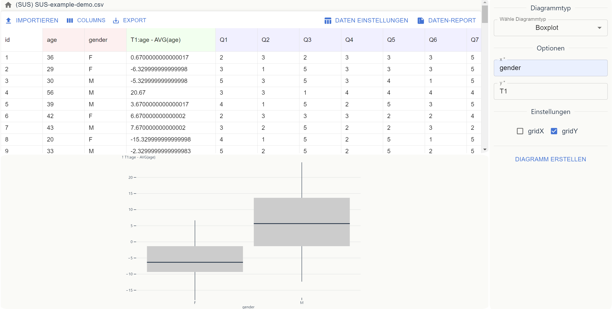
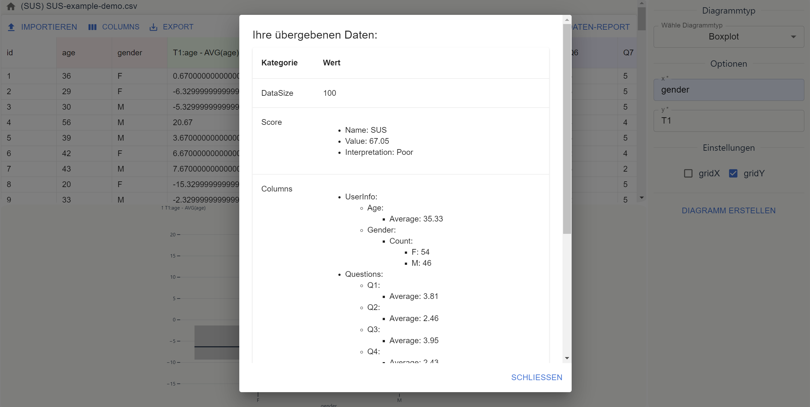

# mme-sose24-statistics

## About the app

This is a statistical tool for basic data analysis on usability data. 





## Features

- Import/export of CSV files.
- Interactive data creation and editing.
- Dynamically generated statistic diagrams.
- Supports for multiple types of usability questionnaires (UEQ, SUS, raw TLX, NPS).
- Detailed data report.
- Formula parsing and evaluation for data transformation.
- Human readable error messages.

## Setup

To install the application, run

```bash
$ git clone https://github.com/UniRegensburg/mme-sose24-statistics.git
$ cd mme-sose24-statistics
$ npm install
```

To start the application, run

```bash
$ npm run dev
```

The application will then be running on `http://localhost:5174/`.

## Usage

See [tutorial](docs/user-tutorial.md). For video demonstration, see https://youtu.be/LOki-pQkASo.

## Documentations

### Developer guidelines

See [GUIDELINES.md](docs/tutorials-dev/GUIDELINES.md).

### Architecture

- **Main architecture:** The main architecture contains 3 main parts.

  - **Models:** Consist of data structures called entities. Represent inner logics and provide developer-friendly interfaces.
  - **Services:** Stateless, globally accessible sets of utility functions.

  - **Components:** React components.


- **Interaction between models and components:** `WorkspaceEntity` provides the main entry point for React components. Services may act as intermediate in this interaction.


### Tutorials for developers

[Tutorial on Entities](docs/tutorials-dev/tutorial-entities.md)

[Tutorial on Services](docs/tutorials-dev/tutorial-services.md)

## Technologies and libraries

- [Vite](https://vite.dev/)
- [Vitest](https://vitest.dev/)
- [React](https://react.dev/)
- [D3.js](https://d3js.org/)
- [Observable Plot](https://observablehq.com/plot/)
- [Material UI](https://mui.com/material-ui/)
- [react-resizable-panels](https://github.com/bvaughn/react-resizable-panels)
