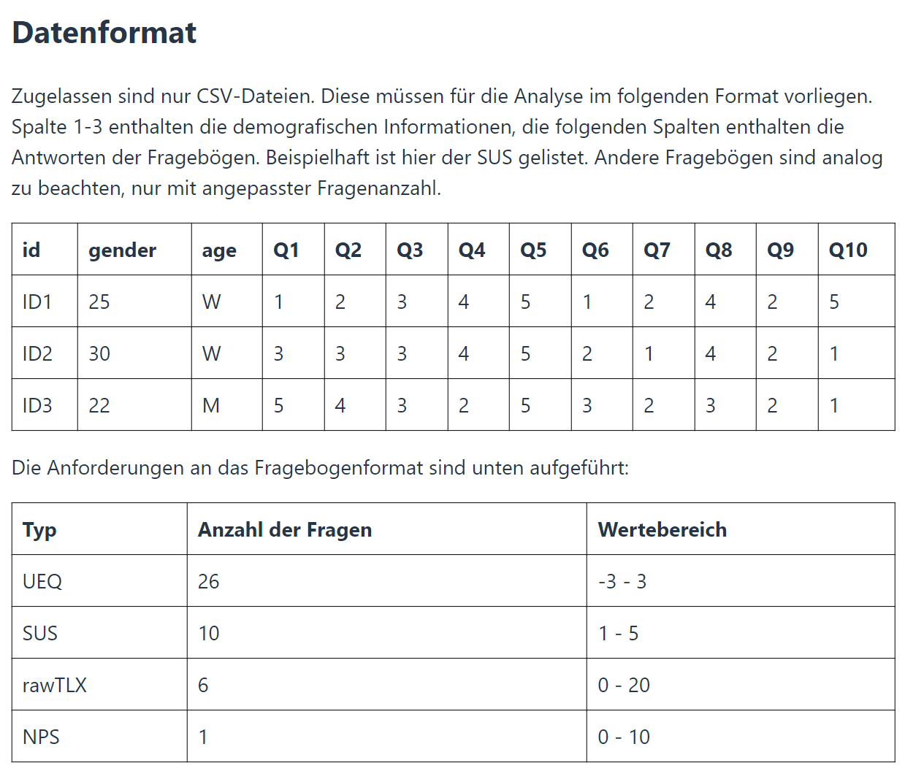
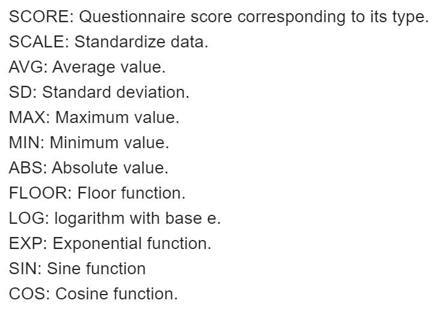

# Tutorial for users

## Homepage

In the homepage, you can choose either to import data from an external CSV file (with the left-hand-side panel), or create your own data using the mask on the right-hand side.  The supported format and questionnaire types are as follow. You could also find this information in the homepage.

## Workspace

- **Data import:** Use the button "IMPORTIEREN" to import CSV data. The application generates a unique id for each row if your data does not contain a column called "id". 

- **Data editing:** Double click on table cells to edit their values. Use the button "DATEN EINSTELLUNGEN" to add/delete columns, or to change type of questionnaire.

- **Data transformation:** In the "DATEN EINSTELLUNGEN" panel, you can find a field "Transformierung hinzufügen". You can type in formulas to create a transformation.

  Examples: 

  - `Q1/Q2`
  - `age-AVG(age)`
  - `SCORE + 50`

  Supported function are as followed. You could also find the same information by click on the help button in the "DATEN EINSTELLUNGEN" panel.

  

- **Plotting:** On the right-hand side is the "modification" panel. You can choose a type of diagram, and enter the required information. When you edit your data, the diagrams will change dynamically.

- **Data report:** Click on the button "DATEN-REPORT" to learn more information about your data. If you have set the type of your questionnaire, it also calculate the score for your data.